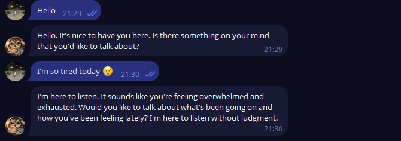

**Sova AI is an AI-powered psychologist bot for Telegram.**

The bot is designed for empathic listening, emotional support, and calm communication.
Sova helps users express their thoughts and reflect on their emotions in a safe and respectful environment.

Features:
- Interactive dialogue with the AI ​​assistant
- Listening mode focused on empathy and support
- Multilingual responses based on user input
- The bot remembers recent message history for more effective communication
- Option to erase the assistant's memory

